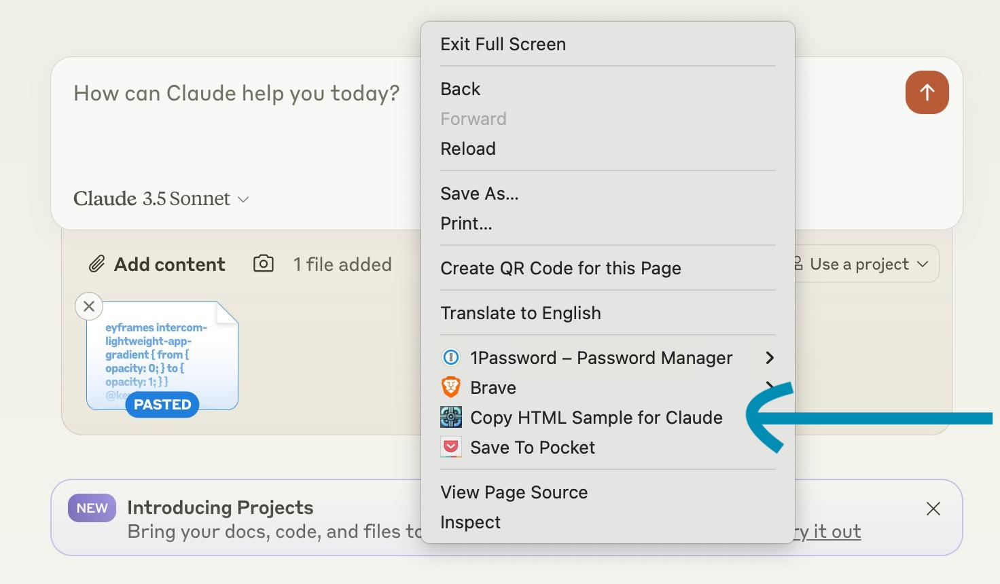

# claude-html-copy
Dead-simple plugin for easy copying of html context for claude.

Right click to copy the current page's (Outer) HTML to clipboard, claude-ready. 

If its too large to copy paste into claude, it will automatically take a (random) chunk of the html that will fit. 

If you definitely need the full html even if it is too large for claude, click the toolbar icon to copy the full OuterHTML to clipboard. This is useful, for example, as input to the python parser claude wrote from seeing your snippet.

## Install
`Clone or download this repo -> chrome://extensions -> Developer mode (On) -> Load Unpacked -> Select manifest.json directory`

Should work on any chromium browser. Tested with Chrome and Brave (brave://extensions).

If you want to use the toolbar icon for full html download, then after install: 

`chrome://extensions -> claude-html-copy "Details" -> Pin to toolbar (On)`

## Why?
Given the right HTML context, Claude-3.5 Sonnet can: 
- explain the web technologies being used
- write you a parser in python or js
- answer questions about the page contents
- ...

How to get the HTML? Naively doing Save Page As -> .html will fail, neglecting dynamically rendered parts of the DOM that you see in your browser and obviously intended to include. Even if you copy the correct OuterHTML using devtools, you then run into Claude chat's copy paste length limit. This is all imminently solvable with some clicking and patiently scrolling to select a subsample of the html that fits. But I'm lazy and this could obviously easy with a simple chrome plugin.

I don't trust random chrome plugins so I made what might be the stupidest, shortest plugin that you can code review in < 1 minute. It now takes two clicks. 

### Why a random sample if the html is too large?
About 2/3 times I've used this, the OuterHTML is too large to paste into claude. This plugin aims to remove extra steps, like manually selecting a section of html to share with claude, while staying stupidly simple. Other simple rules would be to always truncate to just the first part of the html, or just the last part. But the pages I tested varied on whether the semantically interesting parts were at the beginning, end or somewhere in between. There is certainly a better way to do this then taking a random chunk. But its a very simple solution and you can always copy repeatedly until claude sees the context you intended. 

If you want to manually select the region to paste into claude, you can just click the toolbar icon and paste into a text file. 

## Zero external packages, stupid simple code, MIT license
This is deliberately unfurnished, but should be easy to edit (with claude's help and the html context) to have all kinds of functionality. Could edit it to convert to markdown with `turndown.js`, chat with claude directly in the browser, etc. 

Also, I don't know what I'm doing.

